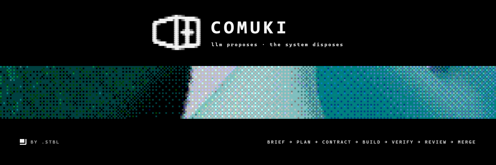

[](https://github.com/dot-stbl/comuki)

[](https://github.com/dot-stbl/comuki/blob/main/LICENSE)
[](https://dotnet.microsoft.com/download/dotnet/10.0)
[](https://bun.sh)
[](https://react.dev)
[](#status)

**A leading model decomposes work and directs a swarm of ephemeral workers in containers** — shared knowledge and rules over MCP; anti-slop via skills, hard analyzers, and a design system as an enforceable contract. The bar for v1.0: any other product can be built from scratch on Comuki.

```text
→ brain proposes · control plane decides
→ workers are ephemeral · state lives outside them
→ verify deterministically · then ask a model
→ skills + analyzers + design system · not vibes
→ human closes the loop · no auto-self-mutation
```

> [!TIP]
> **v0.1 is foundation only** — monorepo, design system, test infra, CI.
> The first runtime vertical slice (**Slice 0**: ticket → claim → worker →
> `StageReport` → container dies) is next. Architecture and decisions live in
> [`.agents/docs/architecture/`](.agents/docs/architecture/).

## See it in action

Target control loop once Slice 0 lands. Marked schematic — the runtime path
is not runnable in this repo yet.

```text
# schematic — Slice 0 control loop (Phase 4)

  ◆  comuki · slice-0

  ticket   TICK-42  "add health probe"
  claim    FOR UPDATE SKIP LOCKED + lease
  worker   container · Translator · pi headless
  ────────────────────────────────────────
  [orchestrator] insert task · spin container
  [translator]   claim TICK-42 · lease=30s
  [pi]           brief → stream-json events
  [translator]   StageActivity · StageReport
  [orchestrator] log StageReport · release lease
  [container]    exit · destroyed

  ▸ result
  status      Done
  ✓ one ticket · one worker · end to end
```

What this proves (and what it deliberately skips): pull-claim, Translator/gRPC,
and a disposable container. Proxy, knowledge/MCP, verification gate, and DAG
come in later slices — see [Status](#status).

<details>
<summary><strong>Under the hood — stack and layout</strong></summary>

Polyglot monorepo, top level by stack:

| Path | Stack | Role |
|------|-------|------|
| `platform/` | C# / .NET 10 | Orchestrator, YARP proxy, knowledge, rules, Translator |
| `agents/` | TypeScript | `comuki-agent-core` · `comuki-worker-sdk` (pi) · `comuki-dev-sdk` |
| `dashboard/` | React 19 + Vite + shadcn | Operational UI |
| `control-plane/` | markdown / configs | Swarm rules and skills (not product code) |
| `deploy/` | Docker Compose | postgres+pgvector, minio, nexus, victoria |
| `tests/` | C# | Unit / integration / architecture |
| `.agents/` | markdown | Rules, docs, phases, STATE — agent harness contour |

Seams planned for runtime: gRPC (Translator ↔ orchestrator), MCP (agents ↔
knowledge/rules), SignalR (dashboard). Observability: OpenTelemetry → Victoria.
Everything self-hosted.

Comuki does **not** write its own product code — it is the tool that builds
*other* projects.

</details>

## Quick Start

**Requirements:** [.NET 10 SDK](https://dotnet.microsoft.com/download/dotnet/10.0),
[bun](https://bun.sh) 1.x. Optional for local infra: Docker.

```bash
git clone https://github.com/dot-stbl/comuki.git
cd comuki
```

Backend (warnings-as-errors; format gate is part of the solution build):

```bash
dotnet build comuki.slnx -c Debug
dotnet run --project tests/Comuki.Platform.Orchestration.Unit.Lease
```

Frontend:

```bash
cd dashboard
bun install
bun run typecheck && bun run lint && bun run test
bun run build
```

Local compose stack (postgres, minio, nexus, victoria) lives under `deploy/` —
bring it up yourself when you need infra; this README does not start long-lived
servers for you.

> There is no installable NuGet/npm package yet. You clone and build the
> monorepo. Agent SDKs land with the runtime slices.

## Docs

| Doc | What it answers |
|-----|-----------------|
| [Architecture index](.agents/docs/architecture/README.md) | Map of the design set |
| [Architecture](.agents/docs/architecture/comuki-architecture.md) | Principles, services, control loop |
| [Decisions](.agents/docs/architecture/comuki-decisions.md) | Why those choices (with alternatives) |
| [Project structure](.agents/docs/architecture/comuki-project-structure.md) | Repo layout and C# layers |
| [Slice 0](.agents/docs/architecture/comuki-slice-0.md) | First vertical slice plan |
| [v1.0 scope draft](.agents/docs/architecture/comuki-v1-scope-draft.md) | Horizon: build any product from scratch |
| [STATE](.agents/STATE.md) · [ROADMAP](.agents/ROADMAP.md) | Where we are / what is next |
| [AGENTS.md](AGENTS.md) | Entry for agent harnesses working in this repo |

## Status

**Milestone v1 · phase 3 complete · next: Phase 4 / Slice 0.**

| Done (v0.1) | Next |
|-------------|------|
| Polyglot monorepo + `comuki.slnx` | Slice 0 — one ticket through one worker |
| Design system (Comuki palette, IBM Plex Mono, status tokens) | Slice 1 — model proxy + virtual keys |
| BE/FE test infra (xUnit v3, Vitest, 70% line floor) | Slice 2 — knowledge / MCP |
| GitLab CI (`build` + `test` for BE and FE) | Slice 3 — verification gate |
| Deploy compose skeleton | Slice 4 — DAG + dashboard |

Honest limits today: **workers do not ship yet**. No claim loop, no Translator
container path, no public runtime API. Treat this as an early foundation repo
with a locked architecture — not a runnable swarm platform.

## Contributing

Read [AGENTS.md](AGENTS.md) first — it is the orientation surface for humans and
agent harnesses alike (build gate, commit format, stack boundaries).

- Prefer small, reviewable changes against the current phase in
  [`.agents/ROADMAP.md`](.agents/ROADMAP.md).
- `dotnet build comuki.slnx -c Debug` must stay green (warnings-as-errors).
- Do not start long-lived `dev` / `watch` / browser-automation processes from an
  agent session — see the process rules under `.agents/rules/`.

Issues and discussion: [github.com/dot-stbl/comuki](https://github.com/dot-stbl/comuki).

## License

[MIT](LICENSE) © 2026 .stbl
