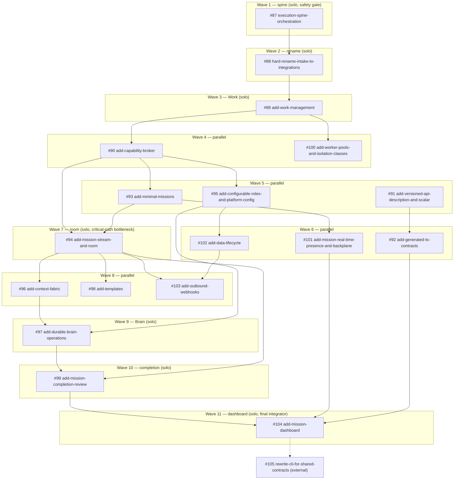

# add-mission-cowork — Decomposition Index

This is the routing table from the `add-mission-cowork` umbrella (issue #70,
19 phases / 131 tasks in `tasks.md`, 11 new + 9 modified capabilities in
`design.md`/`architecture.md`) into 18 separately reviewable OpenSpec child
changes, tracked as GitHub issues **#87–#104** (issue **#105**,
`rewrite-cli-for-shared-contracts`, is a related but *separate* CLI epic —
see "Not one of the 18" below). It satisfies `tasks.md` task **1.1**.

Each child change, when actually authored, must carve its own
`proposal.md`/`design.md`/`tasks.md`/`specs/<capability>/spec.md` out of the
umbrella's existing `design.md`, `architecture.md`, and `specs/*/spec.md` —
this index says *which* umbrella tasks and *which* delta-spec requirements
belong to each one, so a cheap-model agent can execute one row without
re-deriving the whole epic.

## How to read the table

- **Issue** — GitHub issue number (`gh issue view <n> -R dot-stbl/comuki`).
  All 18 are open, currently stub-only (`.openspec.yaml` shell in the issue
  body, no `proposal.md` yet in the repo).
- **Epic task ids** — `tasks.md` checkbox ids this change is responsible for
  closing. Several changes own a "foundation" section plus a later
  "extension" section (design.md's own Epoch split) — both are listed.
- **Spec deltas** — folder(s) under `add-mission-cowork/specs/` this change
  draws from, and whether the *target* `openspec/specs/<capability>/` gets a
  new folder (**ADD**) or an existing one edited (**MODIFY**, target listed).
- **Exists today** — from a fresh grep of `platform/src` on current master
  (commit `f02e3fef`); "greenfield" means no prior art at all.
- **Wave** — recommended execution wave (topological level, tightened for
  module-boundary parallelism — see "Wave plan" below). Not the same as the
  issues' own declared dependency lists, which are broader; see Open
  Question 5.

| # | Issue | Epic task ids | Spec deltas (ADD / MODIFY) | Depends on (issue-declared) | Exists today | Conflicts / overlaps | Size | Wave | Test tier(s) |
|---|---|---|---|---|---|---|---|---|---|
| **execution-spine-orchestration** | #87 | §2 (2.1–2.7) | MODIFY `runs` (status set, transition table, atomic journal, cancellation endpoint), MODIFY `worker-runtime` (partial — see #100) | none (DAG root) | `WorkItem`/`WorkItemDependency` exist but dependency edges **not enforced at claim** (`WorkItemQueueSql.cs`/`WorkItemQueueEf.cs`). `a6e9df17` just landed a first slice of run-status-from-work-item-transitions (activation-on-first-claim, finalize-on-last-terminal-item) — not the full outbox/fencing story. No `Generation`/fencing concept anywhere. No `outbox_messages`/`IOutbox` anywhere in `platform/src` — fully greenfield. | Gate B in design.md — everything Work/Mission-shaped is declared to wait on this; it's the connective-tissue safety gate, not just a file dependency | L | 1 | T0 unit (status machine, fencing) + T1 integration (Testcontainers: `FOR UPDATE SKIP LOCKED` outbox, concurrent claim/terminate races) + extend `tests/integration/Comuki.Host.Translator.Integration.PiCli/TranslatorE2EShould.cs` and `tests/integration/Comuki.EndToEnd.AgentLoop/` for the crown path (task 2.7) |
| **hard-rename-intake-to-integrations** | #88 | §3.0 | MODIFY `intake` → becomes the `integrations` capability (the delta file is still named `intake/spec.md` in the epic — rename it when this change is authored) | #87 | `Comuki.Modules.Intake.{Domain,Application,Infrastructure}` fully present, `IncomingTicket` entity, `IntakeDbContext`/`intake` schema, 5+ migrations. Pre-release hard reset — no compat aliases, dev/stage data reset. | None in code (clean rename target); the *decision* to reset dev/stage data rather than dual-write is already made in architecture.md — nothing left to negotiate | M | 2 | T0 unit (renamed handlers) + T1 integration (fresh migration baseline via Testcontainers, verify no stale generated client references) |
| **add-work-management** | #89 | §3.1–3.7 + §19.1,19.2,19.3,19.5 (extension) | ADD `work-management` | #87, #88 | No `Task`/`WorkTask` aggregate anywhere (`class Task\b` = 0 hits) — `Run` and `IncomingTicket` are still the only durable goal-shaped entities. Fully greenfield. | `work-management` spec is the sole owner of "Primary and related sources" / "Task relations" / "Cross-Mission dependencies" (§19) — don't let `add-minimal-missions` re-litigate cross-Mission blocking edges | XL | 3 | T0 unit (legal/illegal Task transitions) + T1 integration (outbox/inbox dispatch, backfill migration per task 3.6 against Testcontainers fixtures for *every* existing state) + T2 scenario (`tests/tools/Comuki.AgentTest.Runner` + fake model: admission → Task → Run-attempt loop end to end) |
| **add-capability-broker** | #90 | §5.1–5.8 | ADD `capability-broker` | #88, #89 | No generic command/query broker or `*Broker` type anywhere. `Comuki.Host/Mcp` and `Comuki.Host.Brain/Brain/Tools` are exactly the "two competing private catalogs" design.md calls out as the problem. Fully greenfield. | Exposure-class hard-deny and distinct-human-approval logic is *also* listed under the `identity` spec delta — see Open Question 4 | XL | 4 (parallel with worker-pools) | T0 unit (policy/autonomy/idempotency ledger) + T1 integration (durable operation lifecycle, Postgres) + T2 scenario (same capability — e.g. Task creation — invoked via HTTP/CLI-JSON/MCP/Brain proposal, assert identical effect+authorization) |
| **add-minimal-missions** | #93 | §4.1–4.6 + §19.4 (extension) | ADD `missions` (partial — see Open Question 3) | #87, #88, #89, #90 | No `Mission` entity/module anywhere (only hit is the proposal.md prose itself). Fully greenfield. | `missions/spec.md` in the epic is a **superset**: its 11 requirements span this change *plus* `add-mission-stream-and-room` *plus* `add-mission-completion-review` (see Open Question 3 for the exact split I recommend) | L | 5 (parallel with #91, #95) | T0 unit (access decision, promotion) + T1 integration (API-level, 3+ participants per task 4.6) + adversarial-authorization subset (outsider denial — feeds crown task 13.3) |
| **add-mission-stream-and-room** | #94 | §6.1–6.6 | ADD `missions` (partial), MODIFY `realtime` (partial — message push half) | #90, #93 (issue also lists #91, #92 — see Open Question 5) | n/a — depends entirely on #93/#90 landing first | Single-writer append log + SignalR push is new infra; shares the `missions` spec file with #93/#99 (Open Question 3) and the `realtime` spec file with `add-mission-real-time-presence-and-backplane` (message stream vs presence/typing halves) | L | 7 (critical-path bottleneck — nearly everything downstream waits here) | T0 unit (sequence/dedupe, gapless commit) + T1 integration (concurrent-writer contention) + T2 scenario (3-participant identical-order proof, task 6.6) via `AgentTest.Runner`-style harness extended for SignalR reconnect/catch-up |
| **add-context-fabric** | #96 | §7.1–7.9, §7A.1–7A.3, §18.1–18.4 (extension) | ADD `context-fabric`, MODIFY `memory` (candidate/conflict/declassification states) | #89, #93, #94, #95 | `Comuki.Modules.Memory.*` is real: `MemoryFact`, `MemoryDigest`, `IMemoryStore`/`EfMemoryStore`, ranking, consolidation. pgvector already wired (`AddPgvectorKnowledgeSchema`, `AlignMemoryEmbeddingTo1536` migrations). No `SourceRef`, provenance graph, Context Pack, or retrieval planner exists — this change is a new layer *on top of* working memory infra, not a rewrite of it. | §1.3's Knowledge-spec question is unresolved and lands squarely here — see Open Question 1. Also owns `Comuki.Shared.Filtering` boundary-keeping (§7A) so Filtered DSL doesn't grow FTS/vector semantics | XL | 8 (parallel with #98, #103) | T0 unit (pack compiler, ranking) + T1 integration (real Postgres FTS+pgvector query plans, task 7.9) + T4 eval (task 7.8 explicitly asks for a retrieval/compaction/security eval suite — `Comuki.AgentEval` golden-task harness, new categories: recall / authority / staleness / citation-precision / visibility-leak / budget-compliance) |
| **add-durable-brain-operations** | #97 | §8.1–8.8a | ADD `brain-operations`, ADD `worker-runtime` requirement "General execution request origin" | #89, #90, #93, #94, #95, #96 | No Brain operation/checkpoint persistence exists; today's chat executor is the only Brain path. Fully greenfield on top of existing `Comuki.Host.Brain`. | `ExecutionRequest` origin enum (WorkTask/BrainResearch/Verification/Discovery/ScheduledJob/Maintenance, task 8.6a) is defined here but consumed by Orchestration (#87's territory) and by `add-worker-pools-and-isolation-classes`' slot claim path — coordinate the enum's landing order with both | XL | 9 | T0 unit (operation/checkpoint state machine) + T1 integration (restart-resume without repeated committed calls) + T2 scenario (`Comuki.TestFakeModel` cassette driving `@comuki` Mission answer-only flow, subbrain fan-out) + T4 eval (delegation/synthesis quality) |
| **add-worker-pools-and-isolation-classes** | #100 | §11.1–11.7, §11.3a | ADD `worker-pools`, MODIFY `worker-runtime` (stream/REST/Translator slot semantics) | #87, #88, #89 | **Direct, load-bearing conflict**: `platform/src/engine/Comuki.Engine.Compute/Pool/WorkerPoolState.cs` (`IWorkerPoolState`) is an in-memory `ConcurrentDictionary<WorkerId, PoolWorker>` — **one `WorkerId` = one worker = one busy/idle boolean, no slot concept at all.** This change must introduce `WorkerHostId` → N independent `SlotId`/`ExecutionId`/`AgentSessionId` and either replace `WorkerPoolState` or bolt slot tracking onto it while keeping `ScaleSupervisorCycle.cs` and `ComputeInstaller.cs` working. Existing tests to not break: `WorkerPoolStateShould.cs`, `ScaleSupervisorCycleShould.cs`. | Task 11.1 explicitly requires "a single-slot compatibility mode," so the cutover is already declared non-breaking in principle — confirm no further ambiguity (Open Question 6) | XL | 4 (parallel with capability-broker — genuinely independent of the whole Mission/Broker chain per its own declared deps) | T0 unit (slot-aware replacements for `WorkerPoolStateShould`/`ScaleSupervisorCycleShould`) + T1 integration (Docker/K8s adapter parity, task 11.7) + T2/T3 (`deploy/compose.e2e.yml` + `tests/integration/Comuki.EndToEnd.AgentLoop/RealPi/` extended to prove concurrent slots on one host can't see each other's mutable workspace, task 11.3) |
| **add-mission-completion-review** | #99 | §9.1–9.5 | ADD `missions` (partial — completion requirements) | #87, #89, #90, #93, #94, #96, #97 | n/a — needs Brain operations (#97) for evidence synthesis + room (#94) | Owns "Mission completion evidence" + "Completion review" out of the shared `missions/spec.md` superset (Open Question 3) | M | 10 | T0 unit (evidence generation, coalescing lease) + T1 integration (concurrent resolution events → exactly one review) + T2 scenario (Brain completion proposal, fake-model cassette) |
| **add-mission-real-time-presence-and-backplane** | #101 | §10.1–10.4 | MODIFY `realtime` (partial — presence/typing half) | #93, #94 | No `IRealtimeBackplane` exists; SignalR is direct today. | Shares `realtime/spec.md` with `add-mission-stream-and-room` (message-push half) — split cleanly: this change owns presence/typing/attention-inbox, the room change owns join/push/catch-up | M | 6 (tightened from issue-declared Wave 8 — presence only needs Mission+membership from #93, not the full stream/proposal-lane from #94; see Open Question 5) | T0 unit (multi-connection roster, typing TTL) + T1 integration (InMemory vs Redis adapters, unsafe-multi-node-InMemory startup failure) + T3 Playwright/k6 (reconnect storms, feeds crown task 13.4) |
| **add-mission-dashboard** | #104 | §12.1–12.5, MODIFY `chat` (task 12.5, personal-chat migration to Broker/Brain-ops) | MODIFY `chat`, consumes `api-contracts` | #87, #88, #89, #90, #91, #92, #93, #94, #101, #99 | Widest fan-in of the 18 (confirmed independently by the issue tracker). Dashboard has Kubb wired already (`dashboard/kubb.config.ts`) generating its own client — must be redirected onto `add-generated-ts-contracts`' package, not left as a second generator. | Tasks 12.3/12.4 (CLI TUI + non-interactive commands) overlap with the separately-tracked `rewrite-cli-for-shared-contracts` (#105) — see Open Question 7 | L | 11 (final integrator) | T3 Storybook interaction/visual/a11y (WS16, already landed), Playwright e2e (WS14), UI probe (WS17); CLI TUI via existing `cli/` bun-test snapshot/reducer harness |
| **add-versioned-api-description-and-scalar** | #91 | §12A.1–12A.3 | ADD `api-contracts` (partial — versioning/OpenAPI/Scalar half) | #88, #90 (issue also lists #87, #89) | `Microsoft.AspNetCore.OpenApi`'s `AddOpenApi()`/`MapOpenApi()` already wired in `Comuki.Host/HostComposer.cs`, producing one unversioned `"v1"` document. No `Asp.Versioning.Mvc`, no `Scalar.AspNetCore`, no URL-segment versioning yet. Builds on existing plumbing, not from zero. | Shares `api-contracts/spec.md` with `add-generated-ts-contracts` — this change owns routes/OpenAPI-document/Scalar-reference requirements, the other owns the generated-package/decoder requirements | S | 5 (parallel with #93, #95) | T0 unit (document filters/transformers) + CI drift check (strict-OpenAPI-excludes-internal-catalogs assertion) |
| **add-generated-ts-contracts** | #92 | §12.6–12.7 | ADD `api-contracts` (partial — TS package half) | #91 | `platform/generated/ts` does not exist. Dashboard already generates its own client via Kubb (`dashboard/kubb.config.ts`) — this is the thing to consolidate, not greenfield tooling. No `comuki-client-contracts` package under `agents/` yet. | Must not become a second parallel generator alongside dashboard's existing Kubb config — this change *redirects* it | M | 6 (parallel with #101, #102) | `codegen:check` CI drift gate (regenerate-and-diff) + T0 unit on forward-compatible decoders (unknown Mission-stream event kinds) |
| **add-configurable-roles-and-platform-config** | #95 | §14.1–14.5, §14.1a | ADD `configuration`, MODIFY `identity` (partial — role/delegation half) | #87, #88, #89, #90 | `Role` is a **fixed C# enum** (`PlatformAdmin, Operator, ProjectAdmin, Approver, Member, Viewer`) with an explicit code comment: "roles live in code only... no custom roles, no DB role rows." Hard rewrite target for task 14.1. `RequiresPermissionAttribute`/`Filter`/`Middleware` plumbing already exists and is reusable — only the role *definition* layer is fixed today. No typed platform-config catalog exists; `ProjectSettings` (scale+flags+budget, single project-scoped aggregate) is the closest prior art, not a thing this change modifies directly. | Shares `identity/spec.md` with `add-minimal-missions` (object access/actor axes) and `add-capability-broker` (hard-deny/distinct-human-approvals) — three separate PRs touching one file (Open Question 4). Mission-role-bundle task 14.3 specifically needs `add-minimal-missions` to exist first even though the rest of this change doesn't. | L | 5 (parallel with #91, #93 — except 14.3, which internally waits on #93 landing within the same wave) | T0 unit (role-version resolution, `own ∩ delegable ∩ scope ∩ policy` check) + T1 integration (widening/tightening against Postgres) + adversarial tests (privilege escalation, last-owner lockout guard) feeding crown task 13.3 |
| **add-templates** | #98 | §15.1–15.5 | ADD `templates` | #89, #93, #94, #95 | `control-plane/{profiles,chat-commands,skills,rules}` already exists as the *procedural* authority layer (markdown+frontmatter, git-versioned) — design.md decision #15 explicitly requires Templates (work-shape schemas) stay separate from it. No collision in code today since Templates doesn't exist, but this change must not touch `control-plane/`. | None beyond the control-plane boundary note above | M | 8 (parallel with #96, #103) | T0 unit (schema/DAG/compatibility validation, no-side-effect dry-run) + T4 eval (task 15.3's "configured evals" publication gate — `Comuki.AgentEval`) + T1 integration (instantiation binding, migration proposals) |
| **add-data-lifecycle** | #102 | §16.1–16.5, §16.2a | ADD `data-lifecycle` | #87, #89, #90, #95 | No retention/hold/crypto-shred code exists. `openspec/specs/artifacts/spec.md` confirms today's actual behavior is the trivial case: "v1 retention = never delete." Fully greenfield. | None found | L | 6 (parallel with #92, #101) | T0 unit (`RetentionPolicy.Evaluate` per resource class) + T1 integration (Testcontainers Postgres+MinIO: crypto-shred, prove backup ciphertext unreadable after key destruction) |
| **add-outbound-webhooks** | #103 | §17.1–17.5 | ADD `outbound-webhooks` | #87, #88, #90, #93, #94, #102 | No outbound webhook code. Intake's `SyncJob`/`RunStatusBridgeComukiWorker` is *inbound* tracker sync-back (Task/Run status → external tracker comment) — an outbox-dispatcher pattern precedent, not reusable machinery. Fully greenfield. | Needs `add-data-lifecycle` specifically for its consent-revocation crypto-shred requirement (task 17.4) | M | 8 (parallel with #96, #98) | T0 unit (HMAC signing, redaction, SSRF/redirect validation) + T1 integration (outbox delivery ordering/dedupe/dead-letter, Postgres) + T2 scenario (hop-limit/loop-suppression against a fake destination server) |

### Not one of the 18

**`rewrite-cli-for-shared-contracts` (issue #105)** — a CLI-rebuild-epic
increment (external ADR-0002/0003 strangler migration of `chat.tsx` onto
`HarnessEngine`), tracked in its own `openspec/changes/rewrite-cli-for-shared-contracts/`
folder with one plan document (`harness-engine-migration-step-1.md`, whose
step 1 has *already shipped* — `4687613c`/`f29a2415`). Its declared
dependencies (`#92, #90, #93, #94, #101, #99, #104`) place it after
essentially the whole Mission chain, and it overlaps with
`add-mission-dashboard`'s tasks 12.3/12.4 (CLI TUI + non-interactive
commands) — see Open Question 7.

## Wave plan

Waves are topological levels tightened for **module-boundary parallelism**
(disjoint C#/TS project trees, confirmed via the code scan above), not a
literal restatement of each issue's declared dependency list — several
issues declare broader dependencies than their actual file/module overlap
requires (Open Question 5). Numbers in brackets are issues.

Waves 4, 5, 6, and 8 are genuine parallel tracks — each pair/triple touches
disjoint project trees (e.g. Wave 4: `Comuki.Engine.Platform.Capabilities`
vs `Comuki.Engine.Compute` + Translator; Wave 8:
`Comuki.Engine.Platform.Context` vs `Comuki.Modules.Templates` vs
`Comuki.Modules.Integrations` webhooks) — per the user's stated preference
for background agents on disjoint file sets. Waves 1, 2, 3, 7, 9, 10, 11
are solo because they sit on the critical path or because design.md itself
declares them a sequencing/safety gate (execution-spine before any
Work/Mission automation; the room before context-fabric/completion/brain
can address Mission-scoped evidence).

## Open questions for the user

1. **Knowledge spec gap.** `tasks.md` 1.3 and design.md's Gate A both say
   "add a Knowledge spec or explicitly exclude generic Knowledge from the
   first Context Fabric slice" — neither happened. There is no
   `specs/knowledge/` folder anywhere in the epic, yet `architecture.md`
   lists a `Knowledge` module and `context-fabric/spec.md` has a
   "Knowledge and procedural sources" requirement that reads from it. Should
   `add-context-fabric` (#96) explicitly exclude generic Knowledge (only
   consume control-plane git as procedural authority, per decision #18), or
   does a Knowledge spec need to be added before #96 is authored?

2. **Crown Verification and Rollout (tasks.md §13) has no owning issue.**
   None of #87–#105 claims 13.1–13.6 (3-participant crown E2E, adversarial
   auth, concurrency/load, ops runbooks, feature-flag rollout). Should this
   become a 19th tracked change (after #104), or is it meant to be
   distributed as acceptance criteria across the last-landing changes
   (#97/#99/#101/#104)?

3. **`missions/spec.md` is a superset spanning three child changes.** Its 11
   ADDED requirements split cleanly as: lifecycle/membership/access/links/
   creation-impact → `add-minimal-missions` (#93); invitations-and-audit-
   access/durable-room-stream/proposals-and-decisions/workspace-and-room-
   projections → `add-mission-stream-and-room` (#94); completion-evidence/
   completion-review → `add-mission-completion-review` (#99). Confirm this
   split (or state a different one) before any of the three authors a
   `specs/missions/spec.md` delta, or two PRs will silently overwrite each
   other's requirement blocks.

4. **`identity/spec.md` is touched by three child changes.** Recommended
   split: `add-minimal-missions` (#93) lands "Mission object access" +
   "Actor, credential, and authorization subject"; `add-capability-broker`
   (#90) lands "Distinct-human approvals" + "Brain control-plane hard deny";
   `add-configurable-roles-and-platform-config` (#95) lands the rest
   (configurable role definitions, delegable ceiling, break-glass,
   configurable Mission roles, service-account participation). Confirm.

5. **Several issues declare broader dependencies than their file/module
   overlap requires** — e.g. #94 (room) lists #91/#92 (API-versioning/
   TS-contracts) as dependencies though the room's core mechanics don't need
   either; #101 (presence) lists #94 though presence only needs Mission
   membership from #93, not the stream itself; #97 (Brain ops) lists #95
   (configurable roles) though nothing in its task list reads role
   definitions directly. Is this intentional (issue authors sequencing for
   safety/predictability) or should the tightened wave plan above supersede
   the issue-declared lists?

6. **Worker-pool cutover.** Task 11.1 already declares a "single-slot
   compatibility mode" for the `WorkerPoolState` → `WorkerHostId`+slots
   migration, so this looks decided. Confirm there's no remaining product
   ambiguity about whether existing single-worker deployments must stay
   fully compatible through the transition, or whether a clean cutover
   (breaking `WorkerPoolStateShould`/`ScaleSupervisorCycleShould` on
   purpose, rewritten rather than kept passing) is acceptable.

7. **CLI ownership split between #104 and #105.** `add-mission-dashboard`
   tasks 12.3/12.4 (Mission TUI + non-interactive commands) and
   `rewrite-cli-for-shared-contracts` (#105, the HarnessEngine strangler
   migration) both touch `cli/`. Should #105 absorb 12.3/12.4 entirely (my
   read of its wider declared dependency list), or does #104 ship its own
   Mission TUI slice independent of the HarnessEngine rewrite's timeline?

## Validation

`openspec validate add-mission-cowork` passes today (before and after this
file was added — this document is index-only prose, not a spec delta, so it
does not change the change's validity).

## Decisions (user, 2026-09-24)

1. **Knowledge** — write a Knowledge capability spec first, as its own change **add-knowledge-spec** (https://github.com/dot-stbl/comuki/issues/160), landing before `add-context-fabric` (#96). #96 depends on it.
2. **§13 Crown verification** — becomes a 19th change **add-mission-cowork-verification** (https://github.com/dot-stbl/comuki/issues/161), after #104; built on the agentic test contour (#128).
3. **Spec splits** — accepted as proposed above (missions: #93/#94/#99; identity: #93/#90/#95). The tightened wave plan **supersedes** the dependency lists declared in the GitHub issues.
4. **Worker pools (#100)** — single-slot **compatibility mode** through the WorkerPoolState → WorkerHostId+slots transition (existing tests keep passing until the cutover change removes them explicitly).
5. **CLI** — Mission TUI and non-interactive commands (tasks 12.3/12.4) move to **rewrite-cli-for-shared-contracts (#105)**; #104 is dashboard-only.
